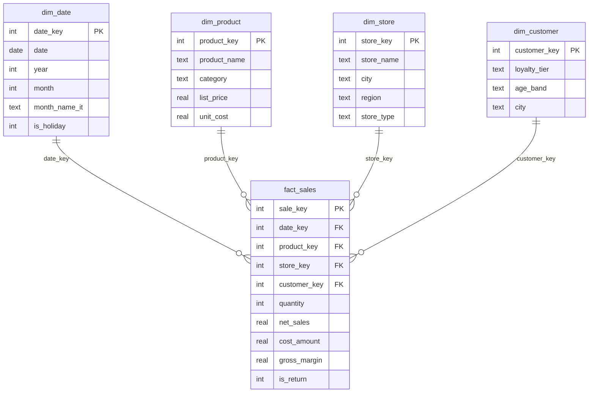

# Data Model (star schema)

A single additive fact surrounded by conformed dimensions — the model Power BI is
happiest with (fast, simple DAX, clean filter propagation).

## Relationships (all single-direction, one-to-many dim → fact)

| From (dimension) | Key | To (fact) | Cardinality | Cross-filter |
|---|---|---|---|---|
| `dim_date[date_key]` | date_key | `fact_sales[date_key]` | 1 → * | single |
| `dim_product[product_key]` | product_key | `fact_sales[product_key]` | 1 → * | single |
| `dim_store[store_key]` | store_key | `fact_sales[store_key]` | 1 → * | single |
| `dim_customer[customer_key]` | customer_key | `fact_sales[customer_key]` | 1 → * | single |
| `dim_date[date]` | date | `forecast_daily[date]` | 1 → * | single |
| `dim_date[date]` | date | `anomalies[date]` | 1 → * | single |
| `dim_store[store_id]` | store_id | `anomalies[store_id]` | 1 → * | single |

**Notes**
- Mark **`dim_date`** as the date table (`dim_date[date]`) — required for time-intelligence DAX.
- `dim_date` extends past the sales data by the forecast horizon so **forecast dates still join**.
- Returns are stored as **negative** measures in `fact_sales`, so plain `SUM` nets them out.
- `forecast_daily` and `anomalies` are analytics outputs (the AI layer), joined on date/store.
